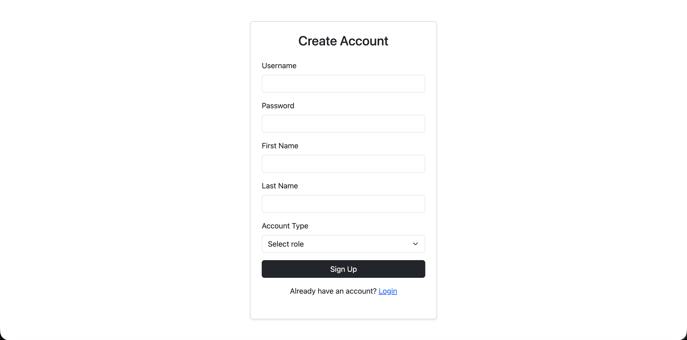
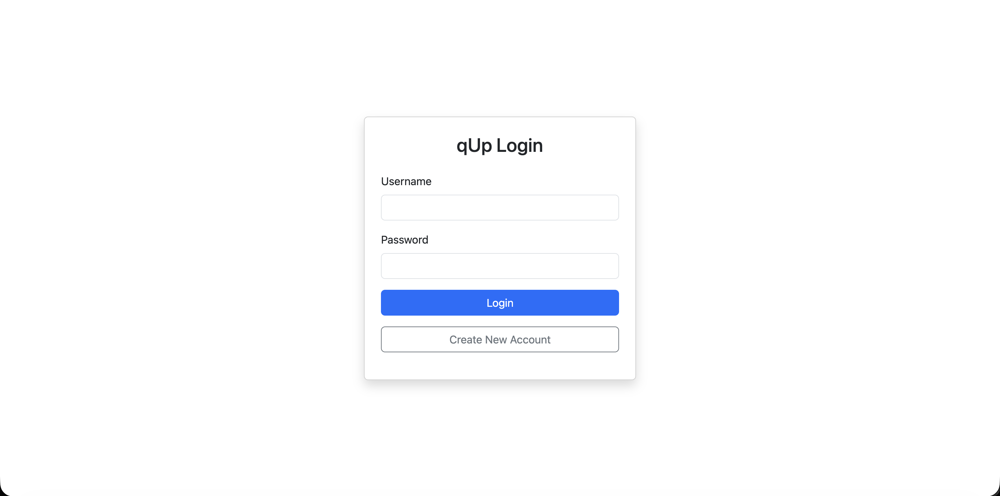
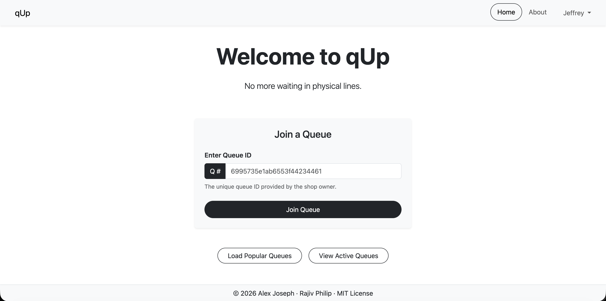
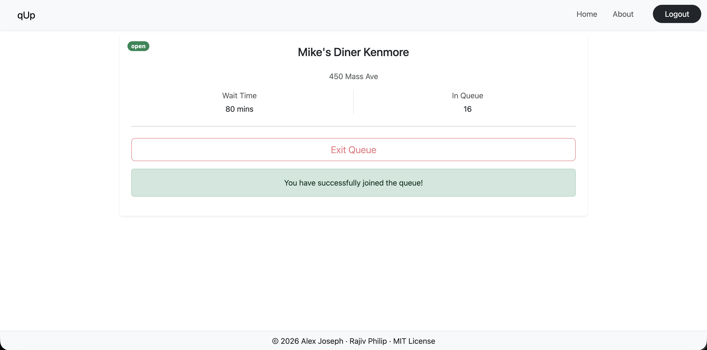
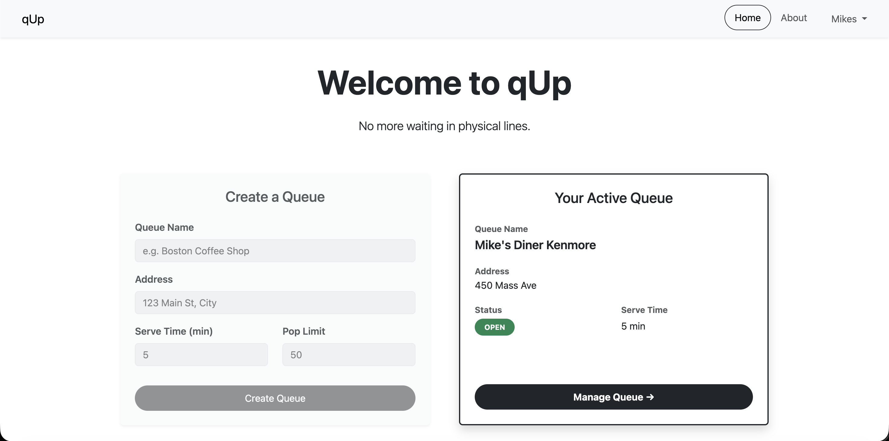
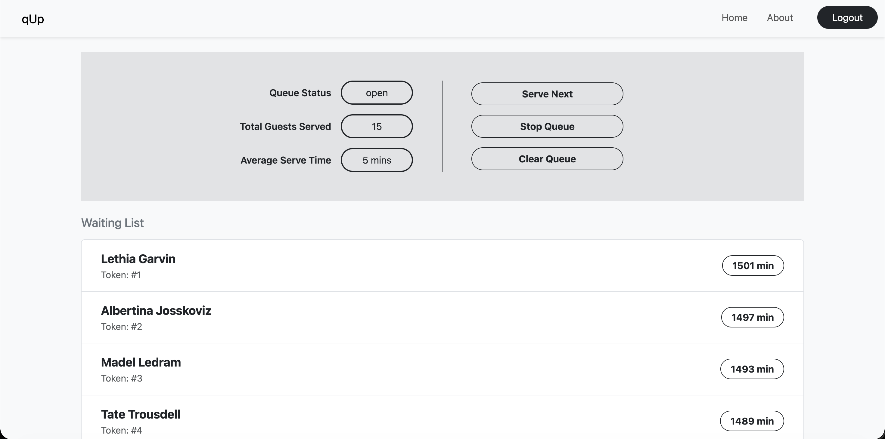
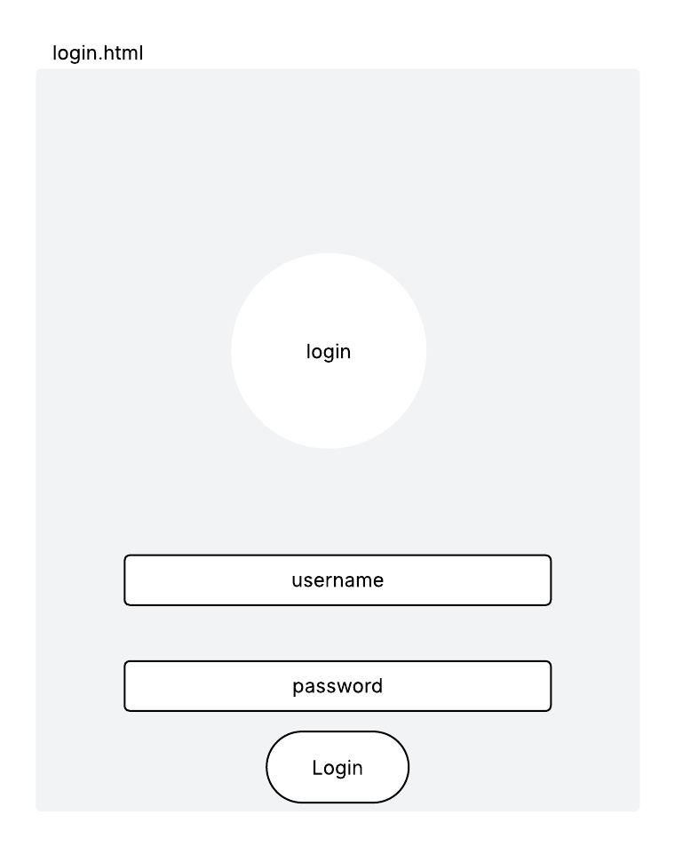
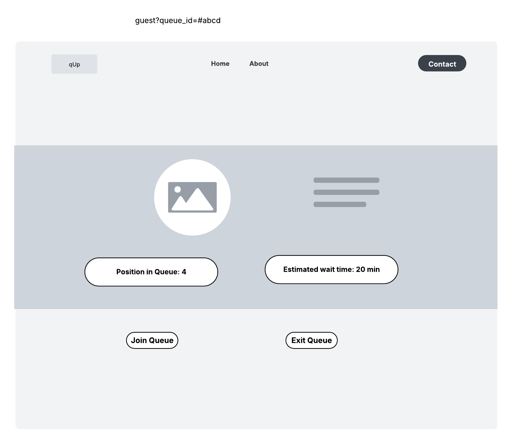
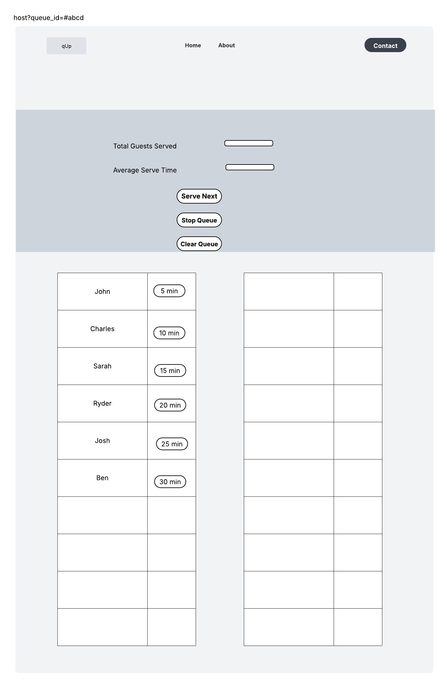

# qUp
A virtual queue management platform designed to eliminate physical waiting lines.

Project Name: qUp (pronounced as "queue-up")

## Project resources link:
- Github: https://github.com/alex710joseph/qUp
- Deployed Application: https://qup-co4p.onrender.com/
- Youtube Walkthrough: https://youtu.be/ncOySQjz1OY
- Design Document: https://docs.google.com/presentation/d/1_4sCZ30w5u77M98LoNGf5g7gAcK2wxN1X2-xCYGB2VM/edit?usp=sharing
- Slide Deck: https://docs.google.com/document/d/1sTvxqxVZOvGP1dXsPFtKfRFWcJdTrL1avWay9HdAPkM/edit?usp=sharing

## Project Build Instructions (to run locally):
1. Clone the repo from the github link: https://github.com/alex710joseph/qUp
2. Open a new terminal and navigate to root of the project
3. run command `npm install`
3. run command `npm run start`
4. the server starts on port 3000, navigate to localhost:3000 to start using the application

## Members:
- Alex Joseph
- Rajiv Philip

Description: qUp is a simple virtual queue management platform designed to eliminate physical waiting lines in various environments like campus career fairs, restaurants, food trucks, student health centers, barbershops, pharmacy pickups, amusement park rides. The web-application allows users to either create a virtual queue or lookup and join a virtual queue. Instead of standing in a physical line, a user can monitor their position and estimated wait time from their own devices, receiving a notification (popup) when they are next in line.

Users who create queues are called as "Hosts" and the users who join queue are called "Guests".

## User Personas:

1. The Busy Recruiter ("Melinda"): Needs to manage a long line of students at a career fair without causing a crowd at her booth. Wants a simple dashboard to "call" the next person when she is ready.
2. The Hungry Student ("Charles"): Wants to join the line for a popular Vietnamese restaurant. The restaurant is small and doesn't have a waiting area, so the customers are waiting outside in a line waiting for a spot to open. Charles doesn't want to stand outside in the freezing Boston winters, but needs to see exactly how many people are ahead of him.
3. The Local Barber ("Sal"): Runs a barbershop where walk-ins often walk right back out when they see a crowded waiting area. He needs a way to show potential customers a real-time wait from their phones so they can run errands nearby and return exactly when their chair is ready, preventing him from losing business to the "visual crowd".
4. The Office Administrator ("Josh"): Manages walk-ins at a government service office. Needs a way to see total daily traffic and clear the queue at the end of the day.

## User Stories

1. Host Controls (Alex Joseph)
- 1.1. Initialize Queue: As a Host, I want to create a new queue by setting a name and estimated service time, so I can begin managing guest flow.
- 1.2. Update Status (Serve Next): As a Host, I want to click a "Serve Next"/"No-Show" button to remove the first guest from the queue and increment the position of all following guests.
- 1.3. Queue Control: As a Host, I want to toggle the status of my queue (Open/Closed), so I can stop accepting new guests when at capacity.
- 1.4. Queue Cleanup: As a Host, I want to delete or clear the entire queue at the end of a session to reset the system for the next day.
- 1.5. Analytics Dashboard: As a Host, I want to see the total number of guests served and the average wait time at the end of my session, so I can plan on improving efficiency.

2. Guest Controls (Rajiv Philip)
- 2.1. Find Host: As a Guest, I want to search for a specific queue by name or Host ID, so I can find the right place to wait. - correction - for this the prof wants ppl to find by url not host id
- 2.2. Join Queue: As a Guest, I want to submit my name and contact info to a specific queue's collection in MongoDB, so I am officially part of the line.
- 2.3. Live Position: As a Guest, I want to fetch my current position in queue and estimated wait time, so I can see how many people are still ahead of me.
- 2.4. Voluntary Exit: As a Guest, I want to be able to remove my entry from the queue if I can no longer wait, ensuring the Host’s list remains clean.
- 2.5. Pre-Join Preview: As a Guest, I want to see the current number of people in a queue and the total estimated wait time before I commit to joining, so I can decide if it’s worth the wait.

## Screenshots

### User Signup
A user can signup as a "guest" or as a "host", by selecting the required role in the "Account Type" dropdown:

### Guest Workflow
After the guest logs in through the login screen:

The guest can join the queue by entering the queue id or by viewing popular queues:

Once the guest has joined the queue, they can view their position and estimated wait time in the guest waiting screen. The guest also has control to exit the queue:

### Host Workflow
After the host logs in through the login screen, they can create a new queue or click to manage their existing queue:

The host can "serve next", "stop queue" or "clear queue" in the queue management page:

## UI Mockups:
### Login Page

### Landing Page

### Guest Page

### Queue Page

## Tech Stack:
- Backend: Node.js + Express
- Database: MongoDB (Native Driver)
- Frontend: HTML5, CSS3, Bootstrap 5, Vanilla ES6 JavaScript

## GenAI Usage:
- Used Claude Sonnet 4.6 model to write the module for managing sessions within the application. Prompt used was:
`given a web development project, help me manage sessions for the application using express-session`.
- The default session management using express-session did not work in the production deployment on render.com. Hence used Claude Sonnet 4.6 model to modify the session management code to utilize a more stable option, `connect-mongo`. Prompt used was:
`While deploying the application on render, despite using express-session, the sessions do not work as intended. Is there a way to utilize mongo db for storing the sessions (without using mongoose)`.
- Used Claude Sonnet 4.6 to come up with the polling logic for the `/api/guest/queue/${queueId}` endpoint to load latest queue information. Prompt used was:
`I have an API that I need to call regularly every 15 seconds or so, in order to get the most recent information from the server. What would be the best way to keep invoking it every time interval.`